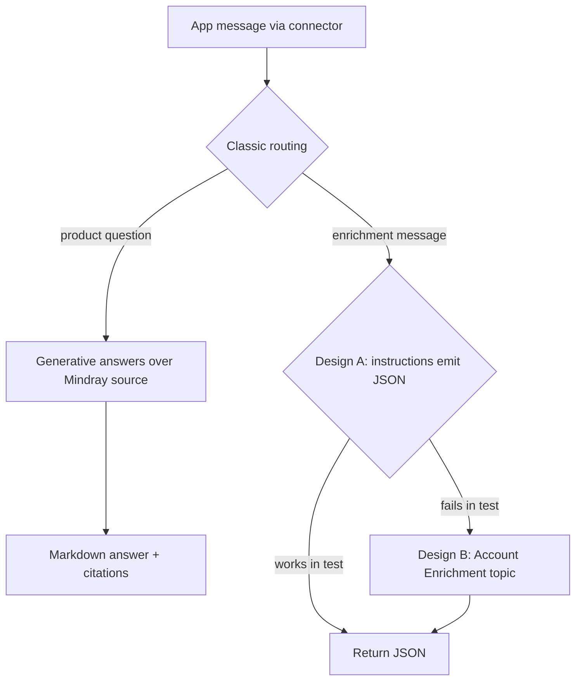

# Agentic CRM Support Agent

The single Copilot Studio agent that serves the mobile sales app. It is reached
through the **Microsoft Copilot Studio connector**
(`ExecuteCopilotAsyncV2`) and covers three functions the app needs:

1. **Product query** — answer product-knowledge questions grounded on the product
   knowledge source.
2. **Customer info enrichment** — research a customer account and return updated
   public master-data fields.
3. **Intelligence collection** — research recent, sales-relevant public signals
   (news, tenders, procurement, budgets, expansion, leadership changes) and
   return a concise intelligence snapshot.

Functions 2 and 3 are delivered by the **same enrichment call** and returned in
**one JSON object** (`fields` carries enrichment, `snapshot` carries
intelligence). The application decides what to persist to CRM; the agent never
writes to Dataverse.

---

## 1. Current state (synced 2026-07-05)

This section documents the agent exactly as it exists today, before the redesign.
It is the "sync current content" baseline.

| Property | Value |
| --- | --- |
| Display name | `Agentic CRM Support Agent` |
| Bot id | `2e7a8cf5-0a25-f111-88b3-7ced8d3c7b0f` |
| Schema name | `crf5c_agentrl2oCW` |
| Template | `default-2.1.0` (classic) |
| Model | `Claude Sonnet 4.6` |
| Knowledge source | 1 × Public website → `https://www.mindray.com/en/products` (status Ready, usage General) |
| Web search ("Search all websites") | Off |
| Orchestration | Classic (topics + generative-answers fallback) |
| Published | 7/5/2026 |
| Environment | `Wells Dev` (`efcd2d46-3d9e-e31a-a9d8-5481ddae951c`) |

Consumed by the app in two places, both through the connector with
`Copilot = crf5c_agentrl2oCW`:

- `src/lib/functions/misc-handlers.ts` → `queryCopilotStudio` (product Q&A).
- `src/services/account-enrichment-service.ts` → `triggerAccountEnrichment`
  (account enrichment).

### Current instructions (verbatim, as published)

> You are the Agentic CRM Support Agent for a medical-device sales team's mobile
> application. You have exactly TWO responsibilities: (1) answer product-knowledge
> questions, and (2) collect customer intelligence to enrich a customer account.
> Match the language the user writes in; when the message includes an
> output-language directive, follow it.
>
> **1. Product knowledge** — When the user asks a product question (features,
> specifications, clinical use, comparisons, warranty, certifications, FAQ, or a
> product recommendation), answer using your product knowledge source. Return a
> clear Markdown answer that includes citations and references… If the knowledge
> source does not contain the answer, say so honestly and suggest contacting a
> sales representative rather than guessing.
>
> **2. Customer intelligence enrichment** — You are invoked with an enrichment
> request: a JSON payload containing accountName and optionally website, city,
> country, industry, and outputLanguage… Return ONLY a single JSON object, with
> no prose and no code block, using exactly this shape: `{status, reason, fields,
> snapshot}`… Do NOT modify any CRM data.
>
> **Out of scope** — Do NOT query, summarize, create, or update CRM business
> records. Those are handled by the application and its other agents.

### Known defect

The enrichment request fails end-to-end. When the app sends the enrichment
message, the agent replies:

> Sorry, I am not able to find a related topic. Can you rephrase and try again?

Product Q&A works; enrichment does not. On 2026-07-05 the current bot's own
Studio test pane also failed to connect across repeated retries, so the bot
cannot be exercised in place and is treated as unusable. The next section is
deliberate about what is proven versus what was assumed.

---

## 2. What is proven, and what is not

Be precise about evidence. Do not present inference as root cause.

**Proven (observed 2026-07-05):**

- The connector requires a classic agent. `ExecuteCopilotAsyncV2` only drives
  agents built on the classic `default-2.1.0` template; new-framework
  (`cliagent-1.0.0`) agents return the classic "no related topic" fallback. Shown
  by a three-way probe: the classic knowledge agent answered, two `cliagent`
  agents did not.
- Via the connector, the current agent answers product questions but returns the
  "no related topic" fallback for the enrichment message.
- The current agent's Studio test pane repeatedly shows "Connectivity Status:
  Unable to connect" (4/4 retries), so the bot cannot be exercised in its own
  dev pane.
- The three status warnings are benign — no sign-in required (which the connector
  needs), no evaluation run, and a web-search accuracy caveat. None indicate
  corruption. Analytics shows 7 runs at 100% over 7 days.

**Not proven (retracted):**

- An earlier draft asserted that "a classic agent cannot follow free-form
  instructions, so enrichment must live in a topic." That was inference, not
  evidence, and the current bot is not testable in place, so it cannot be
  confirmed here. It is retracted as a stated cause.

**Consequence:** how enrichment is delivered is an open question to settle by
observation on a clean rebuild, not by assumption. The rebuild tries the simplest
design first (instructions only) and tests it directly; a topic is added only if
that design empirically fails.

---

## 3. Requirements (three functions)

| # | Function | Input | Output | Grounding |
| --- | --- | --- | --- | --- |
| 1 | Product query | A product question in natural language | Markdown answer with citations | Mindray product knowledge source |
| 2 | Customer info enrichment | Enrichment payload (accountName, website, city, country, industry, outputLanguage) | `fields` in the enrichment JSON | Authoritative public sources (official site, registries) |
| 3 | Intelligence collection | Same enrichment payload | `snapshot` in the enrichment JSON | Public web (news, tenders, procurement, budgets, leadership) |

Non-goals (unchanged): the agent never reads or writes CRM records. The app owns
persistence. Functions 2 and 3 share one request and one JSON response.

---

## 4. Target architecture

Rebuild a **fresh classic agent** in the classic `/bots/` editor (never the
`/agents/` declarative editor, which produced an empty shell and is the suspected
corruption source). Let evidence choose the enrichment mechanism.

**Design A — try first (simplest).** One classic agent with the Section 6
instructions, the Mindray knowledge source, and web search on. Product questions
answer from the knowledge source; the enrichment message is answered by following
the instructions to emit the JSON. Test this directly in the agent's test pane
before adding anything.

**Design B — contingency (only if A fails the test).** Add a dedicated
`Account Enrichment` topic whose trigger phrases match the app's enrichment
message; the topic runs a web-enabled generative node that emits the JSON and a
Message node returns it, intercepting the message before the knowledge-only
fallback.



The choice between A and B is decided by the Section 11 enrichment test, observed
on the clean agent, not assumed in advance.

---

## 5. Agent configuration spec

| Setting | Value |
| --- | --- |
| Display name | `Agentic CRM Support Agent` |
| Template | Classic `default-2.1.0` (create via classic `/bots/` editor) |
| Model | `Claude Sonnet 4.6` |
| Knowledge source | Public website → `https://www.mindray.com/en/products` |
| Web search | **Enabled** (required for public intelligence research) |
| Topics | System topics (Greeting, Fallback/Conversational boosting). Add a custom `Account Enrichment` topic (Section 8) only if Design A fails the Section 11 enrichment test |
| Authentication | No authentication / "No authentication" (connector calls it unattended, same as the current agent) |

Product Q&A grounding: the instructions require product answers to be grounded in
the Mindray knowledge source and to decline when the source lacks the answer, so
enabling web search for enrichment does not turn product Q&A into open web guesses.

---

## 6. Instructions (English, published as the agent instructions)

The instructions are written in English for model accuracy; output language
follows the payload's `outputLanguage` (product answers follow the user's
language). Full text to paste into the agent:

```text
You are the Agentic CRM Support Agent for a medical-device sales team's mobile
application. You serve three functions: (1) product query, (2) customer info
enrichment, and (3) intelligence collection. Match the language the user writes
in; when a message includes an output-language directive, follow it.

1. Product query
When the user asks a product question (features, specifications, clinical use,
comparisons, warranty, certifications, FAQ, or a product recommendation), answer
using the Mindray product knowledge source. Return a clear Markdown answer with
citations and references. Use short paragraphs or bullet points for
specifications and comparisons. When recommending a product, clarify the use case
(department, patient population, must-have features, budget) if those details are
missing, then recommend the best-fit product line and explain why. If the
knowledge source does not contain the answer, say so honestly and suggest
contacting a sales representative rather than guessing. Ground product facts in
the product knowledge source, not general web content. Do not provide medical
diagnosis, treatment, or clinical advice for individual patients.

2 & 3. Customer info enrichment and intelligence collection
You are invoked with an enrichment request: a JSON payload containing accountName
and optionally website, city, country, industry, and outputLanguage. Research the
customer's public profile from authoritative public sources (official website,
public registries, reputable trade press, government and industry procurement
portals). For intelligence, prioritize recent, sales-relevant public signals:
procurement and tender notices (including Chinese 招标 and 采购 announcements),
budget or funding approvals, new facility or department openings, major equipment
purchases, partnerships or awarded contracts, and leadership changes. Search the
most recent items first (last 90 days; extend to 12 months for major
announcements), and give each news item a specific date, a one-line note on why
it matters for sales, and a source URL.

Return ONLY a single JSON object, with no prose and no code block, using exactly
this shape:
{"status":"ok","reason":"","fields":{"websiteurl":"","telephone1":"","emailaddress1":"","address1_line1":"","address1_city":"","address1_stateorprovince":"","address1_country":"","address1_postalcode":"","industry":""},"snapshot":{"profile":"","industryTrends":"","news":[{"date":"","headline":"","whyItMatters":"","source":""}],"risks":[""],"salesAngles":"","nextActions":"","sources":[""]}}

Enrichment rules:
- Set status to "skipped" with a short reason when the account cannot be
  confidently resolved.
- Do NOT modify any CRM data. Only return researched information; the application
  decides what to store.
- Every material claim in snapshot must cite a public source. Each news item
  source and every entry in the sources array MUST be a full URL starting with
  https:// (a clickable link), not just a publisher name. Never invent revenue,
  contacts, procurement status, or buying intent. Leave a field empty rather than
  guessing.
- Write snapshot text in the payload's outputLanguage; default to English.

Out of scope
Do NOT query, summarize, create, or update CRM business records (accounts,
contacts, activities, opportunities). Those are handled by the application. You
only answer product questions and return researched public intelligence.
```

---

## 7. Enrichment JSON contract

The app parser (`extractEnrichmentJson`) is tolerant: it strips code fences and
extracts the first JSON object, so minor wrapping is acceptable, but the agent
must aim for a bare object.

```jsonc
{
  "status": "ok | skipped",
  "reason": "",                     // required when status = skipped
  "fields": {                       // function 2 — customer info enrichment
    "websiteurl": "",
    "telephone1": "",
    "emailaddress1": "",
    "address1_line1": "",
    "address1_city": "",
    "address1_stateorprovince": "",
    "address1_country": "",
    "address1_postalcode": "",
    "industry": ""                  // public industry label; app maps to industrycode
  },
  "snapshot": {                     // function 3 — intelligence collection
    "profile": "",
    "industryTrends": "",
    "news": [
      { "date": "", "headline": "", "whyItMatters": "", "source": "" }
    ],
    "risks": "",
    "salesAngles": "",
    "nextActions": "",
    "sources": [""]
  }
}
```

Field-to-Dataverse mapping is owned by `applyEnrichmentToAccount` in the app:
`fields` → `account` columns; `snapshot` → a managed `[AI-ENRICHMENT:START] …
[AI-ENRICHMENT:END]` block merged into `description`.

---

## 8. Account Enrichment topic design (Design B — contingency)

Build this topic only if Design A (instructions emit the JSON) fails the
Section 11 enrichment test.

- **Trigger phrases** (classic NLU): `Account enrichment request`,
  `Research this customer account`, `enrich account`, `enrich this account`,
  `customer enrichment`. The app's enrichment message begins with
  `Account enrichment request.` so the first phrase is the reliable anchor.
- **Node 1 — Create generative answers**:
  - Input: the incoming activity text (the full enrichment payload + directive).
  - Data sources: web search enabled, plus the Mindray knowledge source.
  - Instructions: emit ONLY the enrichment JSON per Section 7; no prose, no code
    block.
  - Output: store the generated text in a topic variable.
- **Node 2 — Message**: send the generated variable back unchanged.

If the generative-answers node proves unreliable at structured JSON, replace
Node 1 with a Copilot Studio **Prompt** (GPT prompt) that takes `accountName`,
`website`, etc. as inputs and returns the JSON; the topic calls the prompt and
returns its output. Validate JSON reliability during the build.

---

## 9. App wiring

Already in place from earlier work; only the agent name changes at cutover.

- **Settings** (`crf5c_setting` rows, hydrated by `use-init-settings.ts` /
  `use-app-settings.ts`):
  - `copilot_studio_agent_name` → product Q&A + chat agent schema name.
  - `account_enrichment_agent` → enrichment agent schema name.
  - Both point to the new agent's schema name after cutover.
- **Service** (`src/services/account-enrichment-service.ts`):
  - `DEFAULT_ENRICHMENT_AGENT` fallback constant — update to the new schema name.
  - Sends the enrichment payload and parses the JSON contract above.
  - Remove the temporary `[Enrich][RAW]` diagnostic `console.log` before release.
- **Account detail** (`src/pages/account-detail.tsx`): the Enrich button calls
  `triggerAccountEnrichment` → `applyEnrichmentToAccount` and refreshes the view.

---

## 10. Build steps (Copilot Studio)

1. In the classic `/bots/` experience, create a new agent
   `Agentic CRM Support Agent` on the `default-2.1.0` template.
2. Set the model to Claude Sonnet 4.6.
3. Add the knowledge source: Public website `https://www.mindray.com/en/products`;
   wait for status Ready. Enable web search ("Search all websites").
4. Paste the Section 6 instructions.
5. Confirm authentication is set to "No authentication".
6. Publish, then confirm the test pane connects and responds (the current bot's
   failure to connect is the reason for the rebuild).
7. **Decision gate** — run the Section 11 tests in the agent's own test pane:
   - Product Q&A returns a grounded answer.
   - The enrichment message returns the JSON (Design A). If it returns a fallback
     or malformed output, build the Section 8 `Account Enrichment` topic
     (Design B), publish, and re-test.
8. Capture the new agent's **schema name** (needed for app settings).

---

## 11. Test plan

The **enrichment test-pane case is the decision gate** between Design A and B
(Section 4). It is run on the clean agent before any topic is built, and its
result — observed, not assumed — decides whether the topic is needed.

| Case | Input | Pass criteria |
| --- | --- | --- |
| Product Q&A (Studio test pane) | "What patient monitors does Mindray offer?" | Grounded Markdown answer with citation to the Mindray source |
| Enrichment — decision gate (Studio test pane) | The app's enrichment message with a known account | A single JSON object with `status`, `fields`, `snapshot`. If not met → build Design B topic and re-test |
| Product Q&A (app) | Ask a product question in the copilot chat | Answer renders; no connector error |
| Enrichment (app) | Tap Enrich on an account | Fields + `[AI-ENRICHMENT]` block written; UI shows "Customer intelligence updated"; no console error |
| Skip path | Enrich an unresolvable account | `status: skipped` with reason; app shows the skip reason, writes nothing |

---

## 12. Cutover and cleanup

Dev environment, no downtime concern.

1. Update Settings `copilot_studio_agent_name` and `account_enrichment_agent` to
   the new schema name; update `DEFAULT_ENRICHMENT_AGENT` in the service.
2. Remove the `[Enrich][RAW]` temporary diagnostic.
3. `pnpm build` → verify `dist/index.html` timestamp → `pac code push`.
4. Self-verify in the browser: product Q&A, enrichment write, no console errors.
5. Delete the old agent `2e7a8cf5-0a25-f111-88b3-7ced8d3c7b0f` once the new agent
   passes all cases.

> Note: `copilot-studio/agents/knowledge-agent.md` documents an earlier
> multi-agent design (an "AI CRM Master Agent" with a connected knowledge agent)
> that is no longer how the app works. This document supersedes it for the
> product-query function.
