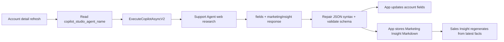

# Agentic CRM Mobile Support Agent

The single Copilot Studio agent called directly by Agentic Sales Mobile. It is
reached through the Microsoft Copilot Studio connector
(`ExecuteCopilotAsyncV2`) and provides:

1. Product knowledge answers grounded in the configured product source.
2. Public account master-data enrichment.
3. Public marketing intelligence collection.

The app-facing agent does not read or write CRM records. It returns researched
content; the app owns validation and persistence.

## Live configuration

Environment: `Wells Dev` (`efcd2d46-3d9e-e31a-a9d8-5481ddae951c`)

| Property | Value |
| --- | --- |
| Display name | `Agentic CRM Mobile Support Agent` |
| Bot id | `5f03fa54-4678-f111-ab0e-0022480401a5` |
| Schema name | `crf5c_AgenticCRMMobileSupportAgent` |
| Template | `default-2.1.0` (classic) |
| Model | Claude Sonnet 4.6 |
| Knowledge source | `https://www.mindray.com/en/products` |
| Web search | Enabled |
| Authentication | None |
| Last verified publication | 2026-07-15 00:46 UTC |

The Dataverse Setting `copilot_studio_agent_name` is the only app-side agent
pointer. Product queries and on-demand enrichment both resolve that setting.
There is no `account_enrichment_agent` app setting, hardcoded fallback, or
second on-demand connector path.

The standalone `Account Enrichment Agent` is a separate background automation
resource. It is not called by the app refresh button. Its role and workflows are
documented in `copilot-studio/account-enrichment-agent/`.

## On-demand enrichment flow



Ownership boundaries:

- Agent: research and content generation.
- `extractEnrichmentJson`: the one response-contract boundary. It extracts the
  first object, repairs common model JSON serialization defects, and validates
  the result before any write.
- `applyEnrichmentToAccount`: field mapping and persistence.
- `MarkdownContent`: the only renderer for `marketingInsight`; the Markdown is
  stored and rendered verbatim rather than reconstructed in the app.

## Enrichment response contract

The agent returns one bare JSON object:

```json
{
  "status": "ok",
  "reason": "",
  "fields": {
    "websiteurl": "",
    "telephone1": "",
    "emailaddress1": "",
    "address1_line1": "",
    "address1_city": "",
    "address1_stateorprovince": "",
    "address1_country": "",
    "address1_postalcode": "",
    "industrycode": null,
    "description": ""
  },
  "marketingInsight": ""
}
```

Contract rules:

- `status` is exactly `ok` or `skipped`.
- A skipped result includes a non-empty `reason` and makes no write.
- `fields.description` is a concise plain-text profile displayed in the account
  header.
- `fields.industrycode` is an integer from the existing Dataverse
  `account.industrycode` option set, or `null` when no reasonable mapping exists;
  it is never a free-text label.
- `marketingInsight` is ready-to-render Markdown with real newlines, Markdown
  bullets, and clickable HTTPS links.
- All JSON string values must be valid JSON strings. Escape ASCII quotation
  marks, backslashes, and control characters; never place an unescaped ASCII
  quotation mark inside a string value.
- Output language follows the payload's `outputLanguage`.
- The agent leaves unverifiable fields empty and never invents facts.

Canonical `industrycode` mapping:

| Code | Label | Code | Label |
| ---: | --- | ---: | --- |
| 1 | Accounting | 18 | Inbound Capital Intensive Processing |
| 2 | Agriculture and Non-petrol Natural Resource Extraction | 19 | Inbound Repair and Services |
| 3 | Broadcasting Printing and Publishing | 20 | Insurance |
| 4 | Brokers | 21 | Legal Services |
| 5 | Building Supply Retail | 22 | Non-Durable Merchandise Retail |
| 6 | Business Services | 23 | Outbound Consumer Service |
| 7 | Consulting | 24 | Petrochemical Extraction and Distribution |
| 8 | Consumer Services | 25 | Service Retail |
| 9 | Design, Direction and Creative Management | 26 | SIG Affiliations |
| 10 | Distributors, Dispatchers and Processors | 27 | Social Services |
| 11 | Doctor's Offices and Clinics | 28 | Special Outbound Trade Contractors |
| 12 | Durable Manufacturing | 29 | Specialty Realty |
| 13 | Eating and Drinking Places | 30 | Transportation |
| 14 | Entertainment Retail | 31 | Utility Creation and Distribution |
| 15 | Equipment Rental and Leasing | 32 | Vehicle Retail |
| 16 | Financial | 33 | Wholesale |
| 17 | Food and Tobacco Processing |  |  |

## Published instructions

The authoritative live instructions are maintained in Copilot Studio and can be
pulled with `pac copilot clone`. They must preserve these responsibilities:

- Product questions use the product knowledge source and return grounded
  Markdown with citations.
- Enrichment requests research authoritative public sources and return only the
  contract above.
- `fields` contains public master data; `description` is plain prose.
- `marketingInsight` contains descriptive intelligence as valid Markdown.
- The agent performs no CRM mutation.
- Before returning, the agent verifies that the full response parses as JSON and
  escapes quotation marks embedded in natural-language values.

## Regression gates

After changing the agent instructions, app parser, or connector configuration:

1. Pull or clone the live agent and confirm the schema name and contract.
2. Run the parser unit tests, including unescaped quotation marks in both `ok`
   and `skipped` responses.
3. Publish the agent and test product Q&A through the app.
4. Refresh a resolvable account and verify profile, master fields, clickable
   Marketing Insight links, and regenerated Sales Insight.
5. Refresh an ambiguous account and verify the skip reason is shown and no
   account or insight row is changed.

The Graph profile-photo `404` and Fluent UI warning emitted by the Power Apps
host are unrelated to this flow; diagnose enrichment from the app bundle,
Copilot connector result, and agent transcript instead.
