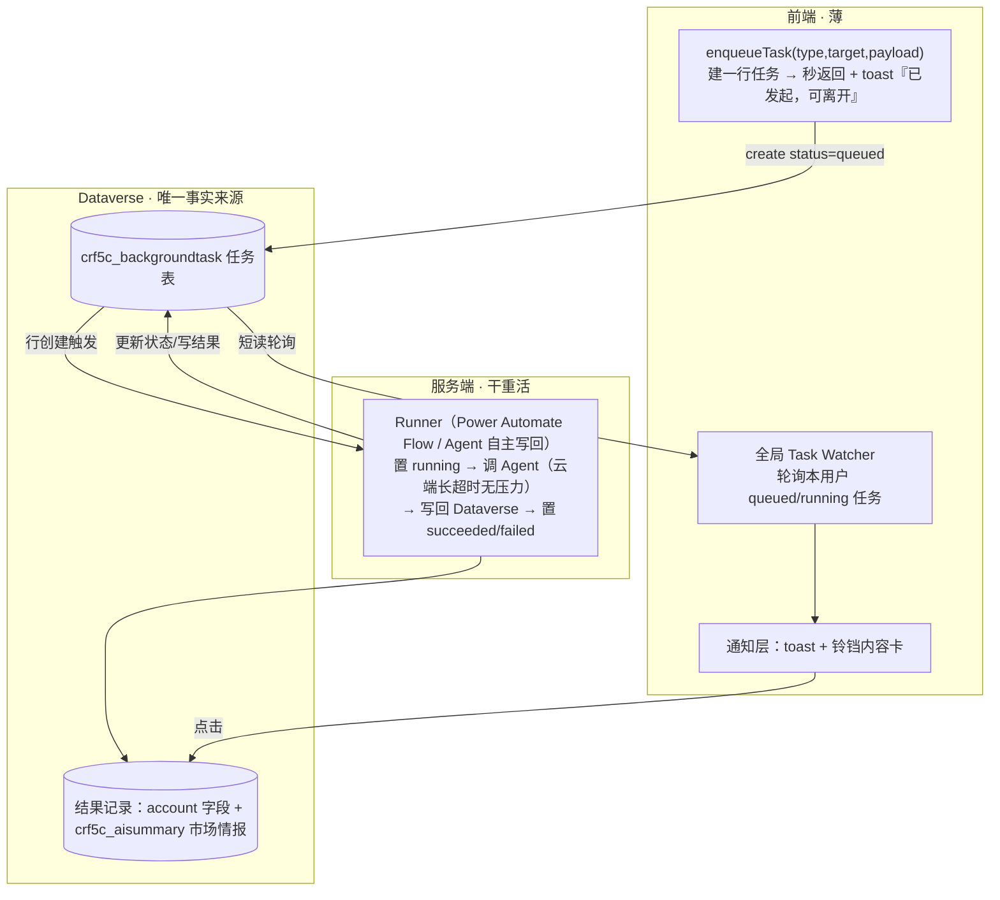

# 通用后台任务架构：长程任务的「发射后不管」

- 日期：2026-07-20
- 状态：**待老板审阅**（审过再动手，先不写代码）
- 一句话：把「客户情报刷新」这类**跑得久的任务**，从「前端挂着干等」升级成「**发起即返回 → 服务端跑 → 完成后通知**」的通用能力，一次建好，以后任何 agent／长任务都能复用，不再逐个打补丁。

---

## 0. 缘起：为什么必须一劳永逸

现状：市场情报刷新走连接器的「执行 Agent 并等待」（`ExecuteCopilotAsyncV2`），本质是**前端把一条连接一直挂着等 Agent 跑完**。桌面浏览器扛得住，手机 Power Apps 播放器（WebView）超时更短、切后台会掐断长连接 → 报「An unknown error occurred」。

如果只把这一个功能改好，那是打补丁。以后销售洞察重算、周报生成、批量富化……每个长任务都会再撞一次同样的墙。所以本设计的目标是：**建一套通用后台任务子系统，所有长程任务统一走它。**

---

## 1. 一个必须先对齐的硬约束（诚实交底）

这是 Power Apps Code App，跑在 WebView 里，**没有操作系统级推送**。所以「无论用户在哪都能收到通知」要拆成两种现实：

| 场景 | 能不能收到 | 怎么收到 |
|---|---|---|
| App 开着（任意页面） | ✅ 能，实时 | 全局 toast + 铃铛红点 |
| App 已关闭 / 切到别的手机 App | ❌ 弹不出系统推送 | **重开 App 时**补一条「你离开时 X 已完成」 |
| 真要「人离开也主动触达」 | 需要另一条通道 | 服务端流程额外发**邮件 / Teams**（本期不做，B 方案天然支持，未来开开关即可） |

**为什么选 B 方案（服务端流程）**：即便本期不发邮件/Teams，B 方案也把「任务完成」这件事彻底从前端会话里解耦——**任务活得过刷新、活得过关 App、活得过换设备**，因为完成与否只看服务端那条记录。这正是「关掉 App 重开还能看到结果」的根基，也是未来被别的 agent 复用的前提。

---

## 2. 通用后台任务架构

### 2.1 三个角色

### 2.2 为什么这样分工能解决问题

- **前端只做两件小事**：建一行任务（秒返回）、轮询任务状态。全是**短 Dataverse 读写**，手机绝不超时。
- **重活全在服务端**：Flow / Agent 在云端跑，超时以分钟计，联网调研随便跑。**完成不依赖前端活着** → 关 App 也没关系。
- **Dataverse 那行任务是唯一事实来源**：谁都不用「记着」任务在哪，读表即知。开 App 第一件事就是读表对账，离开期间完成的自动补通知。

### 2.3 任务表 `crf5c_backgroundtask`（通用，不绑定情报）

| 字段 | 含义 |
|---|---|
| `id` | 主键 |
| `tasktype` | 任务类型：`enrichment` / `insight-regen` / `weekly-report` / …（新任务只加枚举，不改架构） |
| `status` | `queued` → `running` → `succeeded` / `failed` |
| `targetentitytype` / `targetentityid` / `targetname` | 关联对象（如 account / 迈瑞），供通知点击跳转 |
| `requestpayload` | 入参 JSON（如 accountName/website/locale） |
| `resultref` / `resultsummary` | 结果指针（如产出的 AISummary id）+ 一句话摘要（铃铛预览用） |
| `error` | 失败原因（供「重试」与诊断） |
| `requestedby` | 发起人（owner，天然按人隔离） |
| `createdon` / `startedon` / `finishedon` | 时间线 |
| `seenon` | 该发起人是否已看过完成通知（见 §3 已读） |

> 复用性：将来任何长任务 = 「建一行 `crf5c_backgroundtask` + 写一个 Runner」即可接入，铃铛/watcher/toast **全部通用、零改动**。

> 关于写回：客户情报 Agent 的现有指令**已经允许写 `account` 与 `crf5c_aisummary`**（见 [account-enrichment-agent/instructions.md](../../copilot-studio/account-enrichment-agent/instructions.md)），所以 B 方案「服务端写回」与 Agent 现有设计一致，**不需要放权限**。Runner 用 Flow 还是 Agent 自主写回都行，任务表 + 状态机模式不变。

---

## 3. 通知 × 铃铛：语义统一（本设计的核心思考）

老板的疑问抓得很准：现在铃铛装的是 **AI 生成的洞察内容**（能点开看、能跳详情）；如果把「任务完成」也塞进去，是**只放一条通知**，还是**连内容一起放**？只放通知会「感觉奇怪」；已读了是**消失还是保留**？还得和现有洞察卡的已读一起想。

### 3.1 先厘清：两条通道，别混为一谈

| 通道 | 装什么 | 特性 | 例子 |
|---|---|---|---|
| **Toast（瞬时·事件）** | 「发生了一件事」的即时反馈 | 自动消失、不留存 | 「已发起，可离开」「失败了，点重试」 |
| **铃铛 / 通知中心（留存·内容项）** | 「一件值得你看、且有去处的东西」 | 留存、有已读未读、点开看内容 + 跳详情 | AI 洞察卡、**已完成任务的结果** |

**化解「感觉奇怪」的关键**：铃铛里**永远不放一条干巴巴的「你有 1 条通知」**。它放的是**内容卡**——「迈瑞·市场情报已更新」+ 摘要预览 +「查看」。这与今天的洞察卡**语义完全一致**：都是「有内容 + 有去处」。

于是任务生命周期在两条通道上是这样落的：

- **发起** → 只出 toast「已发起，可离开」+ 来源卡片就地显示「研究中…」。**不进铃铛**（避免噪音）。
- **进行中** → 来源卡片就地转圈；**不进铃铛**。
- **成功** → toast「迈瑞·市场情报已就绪」+ **铃铛新增一张内容卡**（标题 + 摘要预览，可展开看全文，点「查看」跳到该客户市场情报）。
- **失败** → toast「刷新失败，点重试」+ **铃铛新增一张「需处理」卡**（原因 + 一键重试）。

> 一句话：**Toast 管「事件」，铃铛管「有内容有去处的成果」。** 只有「成功有结果」和「失败需处理」才进铃铛，「已发起/进行中」不进。

### 3.2 铃铛内容来源：合并两条源，不改坏现有表

铃铛列表 = **合并展示**：
1. 现有 `crf5c_businessinsights`（AI 洞察，保持不动）；
2. `crf5c_backgroundtask` 里 `succeeded/failed` 的任务卡。

两张表**各管各的**（不把任务塞进 businessinsight 表污染它），前端在铃铛里合并、按时间排序、套同一套已读规则。任务卡点击 → 跳 `targetentitytype/id` 对应详情页（如 `/accounts/迈瑞`），全文内容就在那儿。

### 3.3 已读生命周期：保留 + 自动归档（统一给洞察和任务）

给**所有铃铛项**（洞察卡 + 任务卡）用同一套三态，解决「消失还是保留」：

| 态 | 表现 | 计入红点 |
|---|---|---|
| **未读 unread** | 加粗、醒目 | ✅ 计数 |
| **已读 read** | 看过后弱化留在列表，**不消失**（用户可回看） | ❌ |
| **归档 archived** | 离开列表 | ❌ |

**归档只由两件事触发**（不靠用户手动清）：
- **被取代（supersede）**：同一实体 + 同类型出了更新的结果（如再次富化迈瑞 → 旧市场情报卡归档，新的顶上）。
- **过期（TTL）**：`crf5c_aisummary` 本就有 `expiresOn`（市场情报默认 30 天），到期归档。

**和今天洞察卡的关系**：今天洞察本来就是「看过保留、重算换新 id → 自然变未读」，**与上面规则天然一致**；唯一要补的是把「supersede / TTL 归档」显式化，让列表自己清理、不会越堆越长。

### 3.4 一处需要下决心改的地方：已读状态存哪

今天洞察已读存在 **localStorage**（`sales-copilot-read-insights`）——单设备、清缓存就丢、换手机不同步。既然目标是「一劳永逸 + 跨设备可靠」，**建议把「已读/已看」迁到服务端 per-user**（任务用 `seenon`；洞察用一张轻量 per-user seen 记录或同法）。这是唯一需要动今天洞察已读机制的点。

> 我的推荐：**直接上服务端已读**，与「一劳永逸」目标一致。若想减小首期范围，也可 P1 沿用 localStorage、P2 再迁——但会留一小段不一致，我不太推荐。

---

## 4. 端到端流程（站在销售角度）

1. 点「刷新市场情报」→ 立刻 toast「已发起，你可以先去忙别的」+ 卡片转「研究中…」，输入框不被挡。
2. 用户随便去别的客户、别的页，甚至**关掉 App** → 服务端照跑。
3. 完成 → App 开着：toast +铃铛红点 +1；App 关着：**下次开 App** 自动对账补上。
4. 点 toast 或铃铛卡 → 跳到该客户、定位市场情报，看全文。
5. 失败 → 铃铛「需处理」卡一键重试，不用自己回去找。
6. 已读后卡片保留（弱化），被新结果取代或到期才归档，列表不堆积。

---

## 5. 分期实施

| 期 | 内容 | 价值 |
|---|---|---|
| **P0（前置）** | 任务表 `crf5c_backgroundtask` + Runner（Flow / Agent 写回）+ 前端 `enqueueTask` + 全局 Task Watcher | 传输问题根治，手机不再超时；「发射后不管」骨架成立 |
| **P1** | 铃铛合并任务卡 + toast 两通道 + 三态已读（服务端）+ supersede/TTL 归档；enrichment 作为首个接入者 | 完整体验落地 |
| **P2（可选）** | 服务端邮件 / Teams 外部触达；更多任务类型接入（销售洞察重算、周报…） | 「人离开也主动触达」+ 全面复用 |

---

## 6. 待老板拍板（我已给推荐，默认按推荐走）

1. **铃铛放内容（预览+跳转）而非干巴巴通知** —— 推荐：✅ 放内容卡（与现有洞察一致）。
2. **已读后保留、按 supersede/TTL 自动归档** —— 推荐：✅ 保留+自动归档。
3. **已读状态迁服务端**（跨设备一致）—— 推荐：✅ 直接上服务端（符合「一劳永逸」）。
4. **Runner 用 Power Automate Flow 还是 Agent 自主写回** —— 推荐：Flow（可观测、可重试、易扩展邮件/Teams）。

> 若以上无异议，我据此进入 P0 实现；如需调整，请在本文档就地批注。
